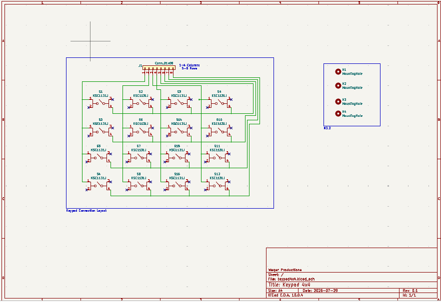
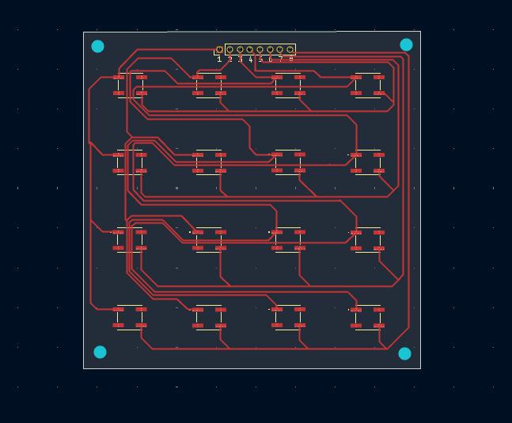
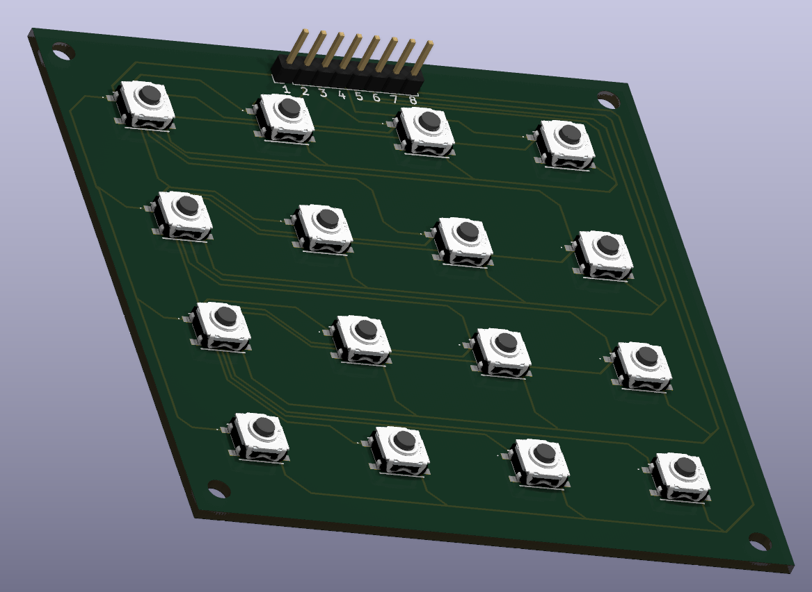

# Keypad 4x4

A 4x4 matrix keypad PCB using 16 tactile push-button switches wired in a row/column matrix, broken out to a single 8-pin header for scanning by an external microcontroller.

| | |
|---|---|
| **Switches** | 16x KSC1131J (SMD tactile switch) |
| **Layers** | 2 |
| **Interfaces** | 8-pin matrix header (4 columns, 4 rows) |
| **Revision** | 0.1 |
| **Status** | In development |

---

## Table of Contents

1. [Overview](#1-overview)
2. [Features](#2-features)
3. [Hardware Description](#3-hardware-description)
4. [Schematic](#4-schematic)
5. [PCB Layout](#5-pcb-layout)
6. [Connector Pinout](#6-connector-pinout)
7. [Getting Started](#7-getting-started)
8. [Repository Structure](#8-repository-structure)
9. [Bill of Materials](#9-bill-of-materials)
10. [Revision History](#10-revision-history)
11. [License](#11-license)

---

## 1. Overview

This board implements a 4x4 tactile matrix keypad intended for use as an input peripheral for a microcontroller-based project. Sixteen SMD tactile switches (S1-S16) are arranged in a 4-row by 4-column grid and wired so the full keypad can be scanned using only 8 GPIO lines (4 column drives, 4 row reads) via a single in-line header. Four mounting holes are provided at the board corners for enclosure integration.

## 2. Features

- 16x KSC1131J SMD tactile switches arranged in a 4x4 matrix
- Single 8-pin header (J1) exposing 4 column lines and 4 row lines for matrix scanning
- Compact square form factor with four corner mounting holes (H1-H4)
- 2-layer PCB, fully routed on front and back copper
- No onboard active components — passive switch matrix only, driven and debounced externally by the host microcontroller

## 3. Hardware Description

The board consists of a single functional block: the switch matrix itself. Sixteen KSC1131J tactile switches are arranged in four rows of four. Each switch bridges a column net to a row net when pressed. Columns 1-4 and rows 5-8 are brought out to header J1, labeled pins 1 through 8 on the silkscreen, so the entire matrix can be scanned by a host microcontroller using a standard row/column GPIO scanning routine with no additional external components required on this board.

Four non-plated mounting holes (H1-H4) are placed at the corners of the board for mechanical mounting into an enclosure.

## 4. Schematic



## 5. PCB Layout

The board is a 2-layer design. Routing uses both front and back copper layers to connect the 16 switch footprints back to the 8-pin header without vias on the switch pads themselves, keeping the top layer clear under each keycap. Four plated mounting holes are located at the board corners.



**3D Render**



## 6. Connector Pinout

Pin assignments below are derived from the schematic and PCB silkscreen. Verify against the source design files prior to integration.

**J1 — Keypad Matrix Header (8-pin)**

| Pin | Signal |
|-----|--------|
| 1 | Column 1 |
| 2 | Column 2 |
| 3 | Column 3 |
| 4 | Column 4 |
| 5 | Row 1 |
| 6 | Row 2 |
| 7 | Row 3 |
| 8 | Row 4 |

## 7. Getting Started

1. **Connect:** Wire J1 to 8 GPIO pins on the host microcontroller — 4 outputs for the column lines (pins 1-4) and 4 inputs for the row lines (pins 5-8), or vice versa depending on the scanning scheme used.
2. **Pull configuration:** Configure the row (input) lines with pull-up or pull-down resistors on the host controller, since this board has no onboard biasing components.
3. **Scanning:** Drive one column low (or high) at a time and read the row lines to determine which key, if any, is pressed in that column. Repeat across all four columns to scan the full 4x4 matrix. Software debouncing is recommended, as no hardware debounce circuitry is present on this board.

## 8. Repository Structure

```
.
├── docs/
│   └── images/
│       ├── schematic.png
│       ├── pcb-layout.png
│       └── pcb-3d-render.png
├── hardware/
│   ├── kicad/            # KiCad project (.kicad_pro/.kicad_sch/.kicad_pcb kept
│   │                     # together so the project opens correctly)
│   ├── gerbers/          # Fabrication-ready Gerber and drill files
│   ├── step/             # 3D board model (.step)
│   ├── library/          # Vendor symbol/footprint/3D files for KSC1131J switch
│   └── bom.csv           # Bill of materials for assembly
├── archive/              # Old backups and export snapshots (not part of the design)
├── README.md
└── LICENSE
```

## 9. Bill of Materials

| Reference | Component | Description |
|---|---|---|
| S1-S16 | KSC1131J | SMD tactile push-button switch |
| J1 | Conn_01x08 | 8-pin single-row male header, matrix connection |
| H1-H4 | Mounting Hole | Corner mounting holes |

A machine-readable copy is available at [`hardware/bom.csv`](hardware/bom.csv). Manufacturer part numbers and LCSC/Digi-Key codes should be added once sourcing is finalized.

## 10. Revision History

| Revision | Date | Notes |
|---|---|---|
| 0.1 | 2026-07-29 | Initial release |

## 11. License

This project is released under the [MIT License](LICENSE).

---

**Author:** Wager Productions
